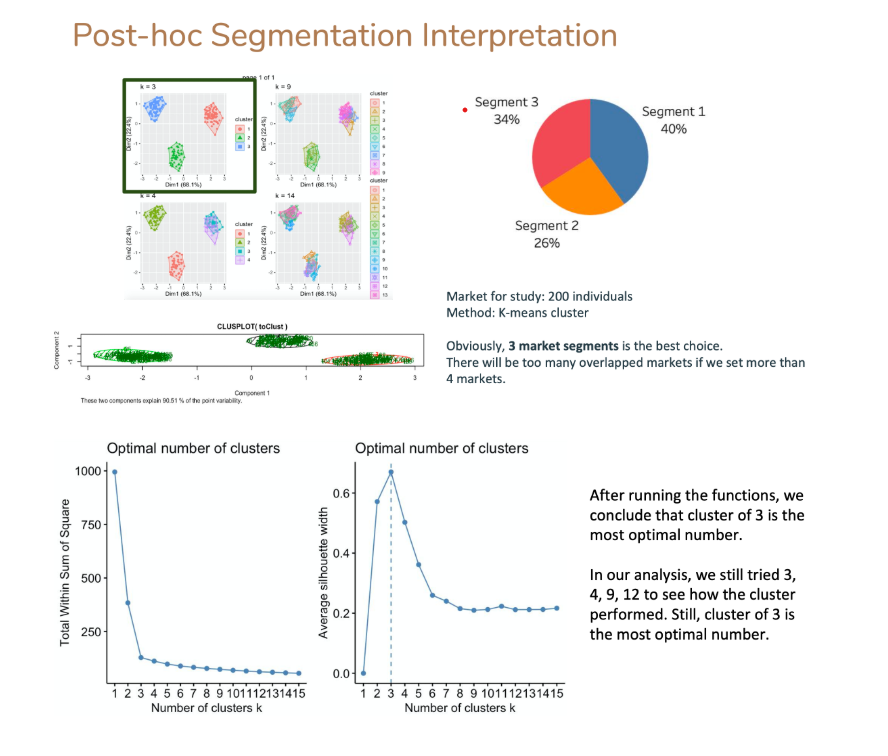
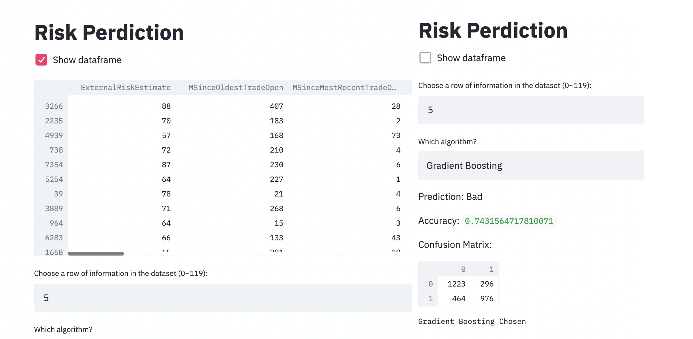

## Projects

### Are people happy with the airline? - Sentiment Analysis with Python (Natural language processing with LDA)

**[View Complete Project in Github](https://github.com/fandagojerry/SentimentAnalysis)**

> For this project, I'm trying to conduct an social media sentiment analysis on airline carrier's twitter account. The data was collected from the university's SQL Server, this can also work with any web scrapper with simple modification. My goal is to analysis whether a tweet about the company is postive or negative so we can understand if the customers is happy with the company or not. The result can be used to improve customer relationships and deciding marketing strategies.

---

### New Product Launch Recommendation for EarlyRiders - Conjoint Analysis and Market Simulation with R

**[View Project Summary PDF on Github](https://github.com/fandagojerry/fandagojerry.github.io/blob/master/Case%203%20Report%20-%20team%2024%20(1).pdf)**

**[View Complete Project in R on Github](https://github.com/fandagojerry/fandagojerry.github.io/blob/master/Conjoint-Experiment-with-R.html)**

> For this project, our team has conducted a conjoint analysis for a small toy company called EarlyRiders, a hand made toy riding horses specialist. The company is suffering for underperforming sales number for its product and decides to research on its product portfolio and reach the potential customers as much as possible. For this purpose,the company ran a conjoint analysis and our team has analyzed the result and ran market simulation with based on our findings. Our team presented the recommendation on what product we should lanuch next to reach all the potential customers. 

---

### Credit Risk Prediction Model and Interactive Interface - Predictive Analysis with Python

**[View Complete Project on Github](https://github.com/fandagojerry/fandagojerry.github.io/blob/master/Credit%20Risk%20Prediction%20Project.ipynb)**

> Our team developed a predictive model and a decision support system (DSS) that evaluates the risk of Home Equity Line of Credit (HELOC) applications. After we conducted the predictive model, we developed a interactive interface, which gives clear explaninations to sales representatives or other higher management in the company. This user friendly interfase helps the people with or without coding experience to easily use the system and decide whether accept or reject applications for house loan. 

---

Page template forked from <a href="https://github.com/evanca/quick-portfolio">evanca</a>

<!-- Remove above link if you don't want to attibute -->
